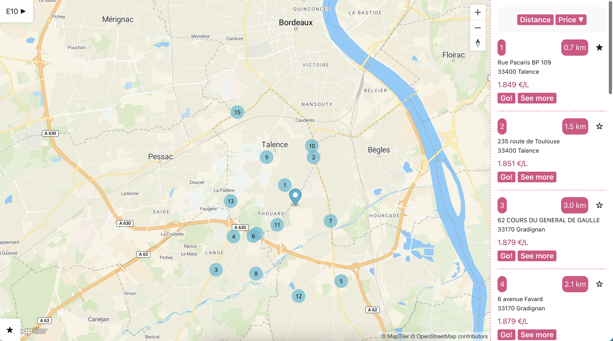
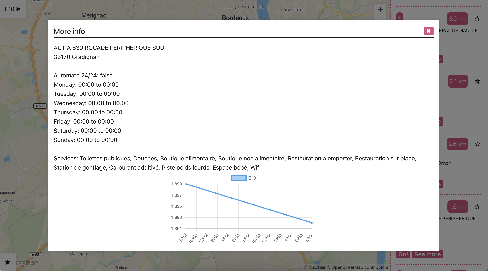

# carburant

The carburant repository manages gas price data in the database using the API instance. It provides functions for adding, updating, and retrieving gas price data.

# Installation

1. `go get github.com/kpotier/carburant`

2. Get an API key from [https://cloud.maptiler.com/](https://cloud.maptiler.com/)

3. Put this API key to `public/src/global.ts`

4. `npm run build`

5. `go run cmd/main.go`

# Screenshots

# License

Ministère de l’Économie, des Finances et de la Souveraineté industrielle et numérique - Données originales téléchargées sur [https://data.economie.gouv.fr/explore/dataset/prix-des-carburants-en-france-flux-instantane-v2/](https://data.economie.gouv.fr/explore/dataset/prix-des-carburants-en-france-flux-instantane-v2/), mise à jour le 21 avril 2023.